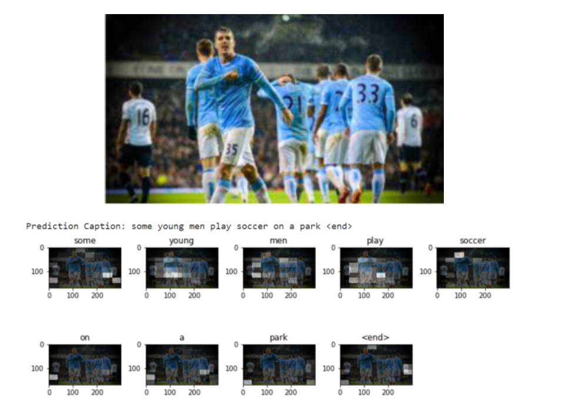

# Image-Captioning-AI

## Model Architecture

Our model used an Encoder-Decoder architecture that used an Encoder to encode the input into a fixed form and a Decoder to decode it, word by word, into a sequence.

### Encoder

The Encoder encodes the input image with 3 color channels into a smaller image with "learned" channels. This smaller encoded image is a summary representation of all that's useful in the original image.

Since we want to encode images, we use Convolutional Neural Networks (CNNs), and we used a pre-trained model via transfer learning. We have chosen to use the **50 layered Residual Network trained on the ImageNet classification task**, already available in PyTorch..

### Decoder

The Decoder was used to look at the encoded image and generate a caption word by word.

Since it's generating a sequence, it would need to be a Recurrent Neural Network (RNN), more specifically, we used an LSTM.

## Attention-Network

The model also uses attention networks. This allows the model to only focus on the relevant parts of the picture. The attention network consists of linear layers and activations. 

The linear layer is used to transform the output and the encoded image from the decoder to the same dimension. This is added to a ReLU activation function and softmax is used to generate the weights. This means the model looks at certain pixels in the images to determine which part to pay attention to next.

## Results

Our results were obtained by randomly generating images the model has never seen before with an online random image generator. 

| Result 1  | Result 2 |
| ------------- | ------------- |
|   |  |

| Result 3  | Result 4 |
| ------------- | ------------- |
|   |  |

